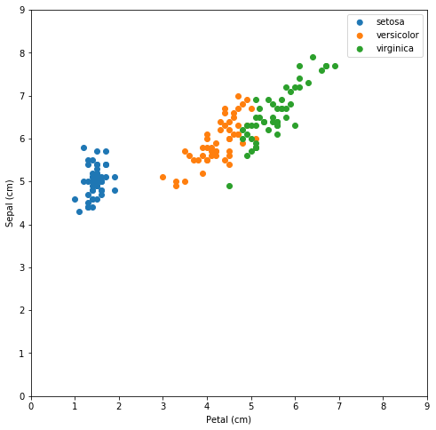
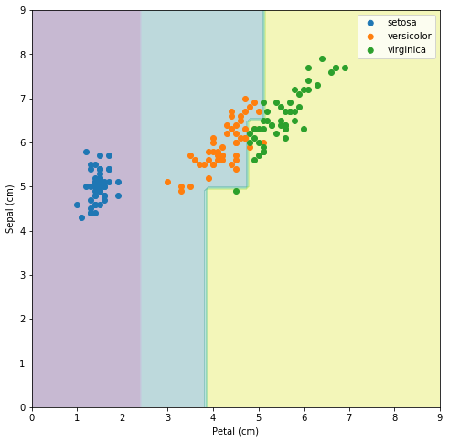
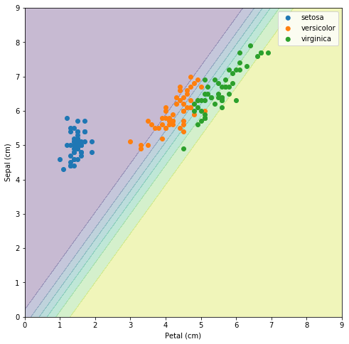
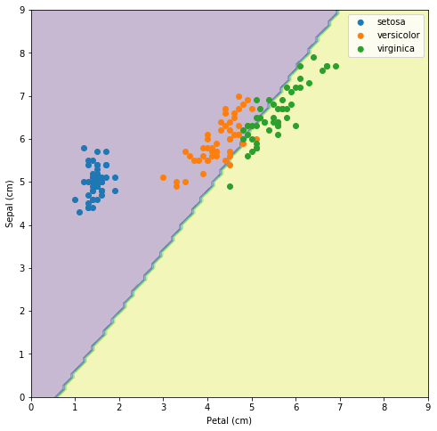

##  ##
### Filename ###
"iris.ipynb"
### cell_ids ###
[]
## Author ##
## Datasets ##
### description ###
""
### links ###
""
### cell_ids ###
[]
## References ##
### source ###
``` 

 ```
### cell_ids ###
[]
## Hyperparameters ##
### cell_ids ###
[11]
### lineNumbers ###
[66]
### source ###
``` 
from sklearn.linear_model import LogisticRegression
 ```
### values ###
["penalty","dual","tol","C","fit_intercept","class_weight","solver","multi_class"]
## Miscellaneous ##
### cell_ids ###
[1,2]
### cells ###
"[object Object][object Object]"
### lineNumbers ###
[1,2,3,4,5,6,7,8,9,10,11,12,13,14,15,16,17,18,19,20,21]
### source ###
``` 
#%matplotlib inline

import matplotlib.pyplot as plt
import numpy as np
from sklearn.model_selection import train_test_split
from sklearn.datasets import load_irisfrom io import StringIO
import pydotplus
from IPython.display import Image
from sklearn.tree import export_graphviz


def treeviz(tree): 
    dot_data = StringIO()  
    export_graphviz(tree, out_file=dot_data,  
                    feature_names=['petal (cm)', 'sepal (cm)'],  
                    class_names=iris.target_names,  
                    filled=True, rounded=True,  
                    special_characters=True)  
    graph = pydotplus.graph_from_dot_data(dot_data.getvalue())  
    return Image(graph.create_png())  
 ```
### functions ###
[]
### figures ###
### description ###
""
### outputs ###

## Plotting ##
### cell_ids ###
[3,8]
### cells ###
"[object Object][object Object]"
### lineNumbers ###
[22,23,24,25,26,27,28,29,30,31,32,33,34,35,36,37,38,39,40,41,42,50,51,52,53,54,55,56,57,58]
### source ###
``` 
def plot_model_decision(model, proba=False):
    plt.figure(figsize=(8, 8))
    xx, yy = np.meshgrid(np.linspace(0, 9, 100),
                         np.linspace(0, 9, 100))

    if proba:
        Z = model.predict_proba(np.c_[xx.ravel(), yy.ravel()])[:, 1]
    else:
        Z = model.predict(np.c_[xx.ravel(), yy.ravel()])
    Z = Z.reshape(xx.shape)
    cs = plt.contourf(xx, yy, Z, alpha=0.3)


    for i, label in enumerate(iris.target_names):
        plt.scatter(X[y == i][:, 0], X[y == i][:, 1], label=label)

    plt.xlabel('Petal (cm)')
    plt.ylabel('Sepal (cm)')
    plt.xlim(0, 9)
    plt.ylim(0, 9)
    plt.legend(loc='best');plt.figure(figsize=(8, 8))
for i, label in enumerate(iris.target_names):
    plt.scatter(X[y == i][:, 0], X[y == i][:, 1], label=label)

plt.xlabel('Petal (cm)')
plt.ylabel('Sepal (cm)')
plt.xlim(0, 9)
plt.ylim(0, 9)
plt.legend(loc='best');
 ```
### functions ###
["def plot_model_decision(model, proba):plt.figure(figsize=(8, 8))\n    xx, yy = np.meshgrid(np.linspace(0,9,100),np.linspace(0,9,100))\n    if proba:        Z = model.predict_proba(np.c_[xx.ravel(), yy.ravel()])[:, 1]    else:        Z = model.predict(np.c_[xx.ravel(), yy.ravel()])\n    Z = Z.reshape(xx.shape)\n    cs = plt.contourf(xx,yy,Z,alpha=0.3)\n    for i, label in enumerate(iris.target_names):plt.scatter(X[(y==i)][:, 0],X[(y==i)][:, 1],label=label)\nplt.xlabel('Petal (cm)')\nplt.ylabel('Sepal (cm)')\nplt.xlim(0,9)\nplt.ylim(0,9)\nplt.legend(loc='best')","def plot_model_decision(model, proba):plt.figure(figsize=(8, 8))\n    xx, yy = np.meshgrid(np.linspace(0,9,100),np.linspace(0,9,100))\n    if proba:        Z = model.predict_proba(np.c_[xx.ravel(), yy.ravel()])[:, 1]    else:        Z = model.predict(np.c_[xx.ravel(), yy.ravel()])\n    Z = Z.reshape(xx.shape)\n    cs = plt.contourf(xx,yy,Z,alpha=0.3)\n    for i, label in enumerate(iris.target_names):plt.scatter(X[(y==i)][:, 0],X[(y==i)][:, 1],label=label)\nplt.xlabel('Petal (cm)')\nplt.ylabel('Sepal (cm)')\nplt.xlim(0,9)\nplt.ylim(0,9)\nplt.legend(loc='best')","def plot_model_decision(model, proba):plt.figure(figsize=(8, 8))\n    xx, yy = np.meshgrid(np.linspace(0,9,100),np.linspace(0,9,100))\n    if proba:        Z = model.predict_proba(np.c_[xx.ravel(), yy.ravel()])[:, 1]    else:        Z = model.predict(np.c_[xx.ravel(), yy.ravel()])\n    Z = Z.reshape(xx.shape)\n    cs = plt.contourf(xx,yy,Z,alpha=0.3)\n    for i, label in enumerate(iris.target_names):plt.scatter(X[(y==i)][:, 0],X[(y==i)][:, 1],label=label)\nplt.xlabel('Petal (cm)')\nplt.ylabel('Sepal (cm)')\nplt.xlim(0,9)\nplt.ylim(0,9)\nplt.legend(loc='best')","def plot_model_decision(model, proba):plt.figure(figsize=(8, 8))\n    xx, yy = np.meshgrid(np.linspace(0,9,100),np.linspace(0,9,100))\n    if proba:        Z = model.predict_proba(np.c_[xx.ravel(), yy.ravel()])[:, 1]    else:        Z = model.predict(np.c_[xx.ravel(), yy.ravel()])\n    Z = Z.reshape(xx.shape)\n    cs = plt.contourf(xx,yy,Z,alpha=0.3)\n    for i, label in enumerate(iris.target_names):plt.scatter(X[(y==i)][:, 0],X[(y==i)][:, 1],label=label)\nplt.xlabel('Petal (cm)')\nplt.ylabel('Sepal (cm)')\nplt.xlim(0,9)\nplt.ylim(0,9)\nplt.legend(loc='best')","def plot_model_decision(model, proba):plt.figure(figsize=(8, 8))\n    xx, yy = np.meshgrid(np.linspace(0,9,100),np.linspace(0,9,100))\n    if proba:        Z = model.predict_proba(np.c_[xx.ravel(), yy.ravel()])[:, 1]    else:        Z = model.predict(np.c_[xx.ravel(), yy.ravel()])\n    Z = Z.reshape(xx.shape)\n    cs = plt.contourf(xx,yy,Z,alpha=0.3)\n    for i, label in enumerate(iris.target_names):plt.scatter(X[(y==i)][:, 0],X[(y==i)][:, 1],label=label)\nplt.xlabel('Petal (cm)')\nplt.ylabel('Sepal (cm)')\nplt.xlim(0,9)\nplt.ylim(0,9)\nplt.legend(loc='best')","def plot_model_decision(model, proba):plt.figure(figsize=(8, 8))\n    xx, yy = np.meshgrid(np.linspace(0,9,100),np.linspace(0,9,100))\n    if proba:        Z = model.predict_proba(np.c_[xx.ravel(), yy.ravel()])[:, 1]    else:        Z = model.predict(np.c_[xx.ravel(), yy.ravel()])\n    Z = Z.reshape(xx.shape)\n    cs = plt.contourf(xx,yy,Z,alpha=0.3)\n    for i, label in enumerate(iris.target_names):plt.scatter(X[(y==i)][:, 0],X[(y==i)][:, 1],label=label)\nplt.xlabel('Petal (cm)')\nplt.ylabel('Sepal (cm)')\nplt.xlim(0,9)\nplt.ylim(0,9)\nplt.legend(loc='best')","def treeviz(tree):    dot_data = StringIO()\nexport_graphviz(tree,out_file=dot_data,feature_names=['petal (cm)', 'sepal (cm)'],class_names=iris.target_names,filled=True,rounded=True,special_characters=True)\n    graph = pydotplus.graph_from_dot_data(dot_data.getvalue())\n    return Image(graph.create_png())","def plot_model_decision(model, proba):plt.figure(figsize=(8, 8))\n    xx, yy = np.meshgrid(np.linspace(0,9,100),np.linspace(0,9,100))\n    if proba:        Z = model.predict_proba(np.c_[xx.ravel(), yy.ravel()])[:, 1]    else:        Z = model.predict(np.c_[xx.ravel(), yy.ravel()])\n    Z = Z.reshape(xx.shape)\n    cs = plt.contourf(xx,yy,Z,alpha=0.3)\n    for i, label in enumerate(iris.target_names):plt.scatter(X[(y==i)][:, 0],X[(y==i)][:, 1],label=label)\nplt.xlabel('Petal (cm)')\nplt.ylabel('Sepal (cm)')\nplt.xlim(0,9)\nplt.ylim(0,9)\nplt.legend(loc='best')","def plot_model_decision(model, proba):plt.figure(figsize=(8, 8))\n    xx, yy = np.meshgrid(np.linspace(0,9,100),np.linspace(0,9,100))\n    if proba:        Z = model.predict_proba(np.c_[xx.ravel(), yy.ravel()])[:, 1]    else:        Z = model.predict(np.c_[xx.ravel(), yy.ravel()])\n    Z = Z.reshape(xx.shape)\n    cs = plt.contourf(xx,yy,Z,alpha=0.3)\n    for i, label in enumerate(iris.target_names):plt.scatter(X[(y==i)][:, 0],X[(y==i)][:, 1],label=label)\nplt.xlabel('Petal (cm)')\nplt.ylabel('Sepal (cm)')\nplt.xlim(0,9)\nplt.ylim(0,9)\nplt.legend(loc='best')","def plot_model_decision(model, proba):plt.figure(figsize=(8, 8))\n    xx, yy = np.meshgrid(np.linspace(0,9,100),np.linspace(0,9,100))\n    if proba:        Z = model.predict_proba(np.c_[xx.ravel(), yy.ravel()])[:, 1]    else:        Z = model.predict(np.c_[xx.ravel(), yy.ravel()])\n    Z = Z.reshape(xx.shape)\n    cs = plt.contourf(xx,yy,Z,alpha=0.3)\n    for i, label in enumerate(iris.target_names):plt.scatter(X[(y==i)][:, 0],X[(y==i)][:, 1],label=label)\nplt.xlabel('Petal (cm)')\nplt.ylabel('Sepal (cm)')\nplt.xlim(0,9)\nplt.ylim(0,9)\nplt.legend(loc='best')","def plot_model_decision(model, proba):plt.figure(figsize=(8, 8))\n    xx, yy = np.meshgrid(np.linspace(0,9,100),np.linspace(0,9,100))\n    if proba:        Z = model.predict_proba(np.c_[xx.ravel(), yy.ravel()])[:, 1]    else:        Z = model.predict(np.c_[xx.ravel(), yy.ravel()])\n    Z = Z.reshape(xx.shape)\n    cs = plt.contourf(xx,yy,Z,alpha=0.3)\n    for i, label in enumerate(iris.target_names):plt.scatter(X[(y==i)][:, 0],X[(y==i)][:, 1],label=label)\nplt.xlabel('Petal (cm)')\nplt.ylabel('Sepal (cm)')\nplt.xlim(0,9)\nplt.ylim(0,9)\nplt.legend(loc='best')"]
### figures ###

### description ###
""
### outputs ###

## Data Cleaning ##
### cell_ids ###
[4,5,6,7]
### cells ###
"[object Object][object Object][object Object][object Object]"
### lineNumbers ###
[43,44,45,46,47,48,49]
### source ###
``` 
iris = load_iris()
iris.target_namesiris.feature_namesX = iris.data[:, [2, 0]]
y = iris.targetX_train, X_test, y_train, y_test = train_test_split(
    X, y, test_size=50, random_state=42)
 ```
### functions ###
[]
### figures ###
### description ###
""
### outputs ###

## Preprocessing ##
### cell_ids ###
[]
### cells ###
[]
### lineNumbers ###
[]
### source ###
``` 

 ```
### functions ###
[]
### figures ###
### description ###
""
### outputs ###

## Model Training ##
### cell_ids ###
[9,10,11,12,13,14,15,16,17,18]
### cells ###
"[object Object][object Object][object Object][object Object][object Object][object Object][object Object][object Object][object Object][object Object]"
### lineNumbers ###
[59,60,61,62,63,64,65,66,67,68,69,70,71,72,73,74,75,76,77,78]
### source ###
``` 
from sklearn.tree import DecisionTreeClassifier

tree = DecisionTreeClassifier(max_depth=4)
tree.fit(X_train, y_train)
treeviz(tree)plot_model_decision(tree)from sklearn.linear_model import LogisticRegression

lr_model = LogisticRegression().fit(X_train[y_train != 0], y_train[y_train != 0])
plot_model_decision(lr_model, proba=True)lr_model.coef_lr_model.intercept_from sklearn.linear_model import Perceptron

linear_model = Perceptron(n_iter=50)
linear_model.fit(X_train[y_train != 0], y_train[y_train != 0])linear_model.score(X_test[y_test != 0], y_test[y_test != 0])linear_model.coef_linear_model.intercept_plot_model_decision(linear_model)
 ```
### functions ###
[]
### figures ###



### description ###
""
### outputs ###

## Evaluation ##
### cell_ids ###
[]
### cells ###
[]
### lineNumbers ###
[]
### source ###
``` 

 ```
### functions ###
[]
### figures ###
### description ###
""
### outputs ###

