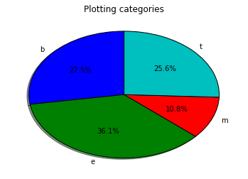
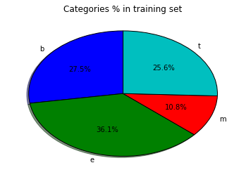
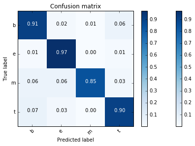

## # News Categorization using Multinomial Naive Bayes
 ##
### Filename ###
"News_Categorization_MNB.ipynb"
### cell_ids ###
-1
## Author ##
## Dataset ##
### description ###
""
### links ###
""
## References ##
https://www.linkedin.com/in/andres-soto-villaverde-36198a5/
https://www.kaggle.com/uciml/news-aggregator-dataset
http://archive.ics.uci.edu/ml
http://archive.ics.uci.edu/ml/datasets/News+Aggregator
http://pandas.pydata.org/
http://ipython.readthedocs.io/en/stable/interactive/magics.html#
https://ipython.org/ipython-doc/3/interactive/magics.html
https://docs.python.org/3/library/collections.html#counter-objects
http://scikit-learn.org/stable/auto_examples/model_selection/plot_confusion_matrix.html#sphx-glr-auto-examples-model-selection-plot-confusion-matrix-py
http://scikit-learn.org/stable/modules/generated/sklearn.utils.shuffle.html
http://scikit-learn.org/stable/modules/feature_extraction.html#common-vectorizer-usage
http://scikit-learn.org/stable/modules/feature_extraction.html#tfidf-term-weighting
http://scikit-learn.org/stable/modules/naive_bayes.html#multinomial-naive-bayes
http://scikit-learn.org/stable/modules/pipeline.html
http://scikit-learn.org/stable/modules/classes.html
https://en.wikipedia.org/wiki/Precision_and_recall
http://scikit-learn.org/stable/modules/generated/sklearn.metrics.accuracy_score.html
http://scikit-learn.org/stable/modules/generated/sklearn.metrics.classification_report.html
http://scikit-learn.org/stable/auto_examples/model_selection/plot_confusion_matrix.html
http://scikit-learn.org/stable/modules/generated/sklearn.metrics.f1_score.html
### cell_ids ###
[-1,0,2,3,8,9,15,17,19,24,32,32,32,32,35,37,40,46]
## Miscellaneous ##
### cell_ids ###
[11,13,15,17]
### cells ###
"[object Object][object Object][object Object][object Object]"
### lineNumbers ###
[1,2,3,4,5,6,7,8,9,10,11,12,13,14,15,16,17,18,19]
### functions ###
""
### figures ###
### description ###
""
### outputs ###
   ID                                              TITLE  \
,0   1  Fed official says weak data caused by weather,...   
,1   2  Fed's Charles Plosser sees high bar for change...   
,2   3  US open: Stocks fall after Fed official hints ...   
,3   4  Fed risks falling 'behind the curve', Charles ...   
,4   5  Fed's Plosser: Nasty Weather Has Curbed Job Gr...   
,
,                                                 URL          PUBLISHER  \
,0  http://www.latimes.com/business/money/la-fi-mo...  Los Angeles Times   
,1  http://www.livemint.com/Politics/H2EvwJSK2VE6O...           Livemint   
,2  http://www.ifamagazine.com/news/us-open-stocks...       IFA Magazine   
,3  http://www.ifamagazine.com/news/fed-risks-fall...       IFA Magazine   
,4  http://www.moneynews.com/Economy/federal-reser...          Moneynews   
,
,  CATEGORY                          STORY             HOSTNAME      TIMESTAMP  
,0        b  ddUyU0VZz0BRneMioxUPQVP6sIxvM      www.latimes.com  1394470370698  
,1        b  ddUyU0VZz0BRneMioxUPQVP6sIxvM     www.livemint.com  1394470371207  
,2        b  ddUyU0VZz0BRneMioxUPQVP6sIxvM  www.ifamagazine.com  1394470371550  
,3        b  ddUyU0VZz0BRneMioxUPQVP6sIxvM  www.ifamagazine.com  1394470371793  
,4        b  ddUyU0VZz0BRneMioxUPQVP6sIxvM    www.moneynews.com  1394470372027  
,Wall time: 7.72 s

## Plotting ##
### cell_ids ###
[21,26,27,29,31,44]
### cells ###
"[object Object][object Object][object Object][object Object][object Object][object Object]"
### lineNumbers ###
[39,40,41,42,43,44,45,46,47,48,49,50,51,52,53,54,55,56,57,58,59,60,61,62,63,64,65,66,67,68,69,70,102,103,104,105,106,107,108,109,110,111,112,113,114,115,116,117,118,119,120,121,122,123,124,125,126,127,128]
### functions ###
""
### figures ###

### description ###
""
### outputs ###
Wall time: 1.06 s
,  category    news   percent
,0        b   81238  0.274738
,1        e  106844  0.361334
,2        m   31930  0.107984
,3        t   75681  0.255945
,total 	 295693

## Data Cleaning ##
### cell_ids ###
[19,42,48]
### cells ###
"[object Object][object Object][object Object]"
### lineNumbers ###
[20,21,22,23,24,25,26,27,28,29,30,31,32,33,34,35,36,37,38,99,100,101,130,131,132,133,134,135,136,137,138,139,140,141,142,143]
### functions ###
""
### figures ###
### description ###
""
### outputs ###
  category    news   percent
,0        b  115967  0.274531
,1        e  152469  0.360943
,2        m   45639  0.108042
,3        t  108344  0.256485
,total 	 422419

## Preprocessing ##
### cell_ids ###
[]
### cells ###
[]
### lineNumbers ###
[]
### functions ###
""
### figures ###
### description ###
""
### outputs ###

## Hyperparameters ##
### cell_ids ###
[]
### cells ###
[]
### lineNumbers ###
[]
### values ###
""
## Model Training ##
### cell_ids ###
[]
### cells ###
[]
### lineNumbers ###
[]
### functions ###
""
### figures ###
### description ###
""
### outputs ###

## Evaluation ##
### cell_ids ###
[34,35,37,39,45,49]
### cells ###
"[object Object][object Object][object Object][object Object][object Object][object Object]"
### lineNumbers ###
[71,72,73,74,75,76,77,78,79,80,81,82,83,84,85,86,87,88,89,90,91,92,93,94,95,96,97,98,129,144,145]
### functions ###
""
### figures ###

### description ###
""
### outputs ###
Wall time: 27.1 s
,             precision    recall  f1-score   support
,
,          b       0.90      0.91      0.90     34729
,          e       0.95      0.97      0.96     45625
,          m       0.97      0.85      0.90     13709
,          t       0.90      0.90      0.90     32663
,
,avg / total       0.92      0.92      0.92    126726
,
,  category  f1-score   percent
,0        b  0.903839  0.274738
,1        e  0.959225  0.361334
,2        m  0.902814  0.107984
,3        t  0.903314  0.255945
,total 	 295693

### 0 ###
"\n"
